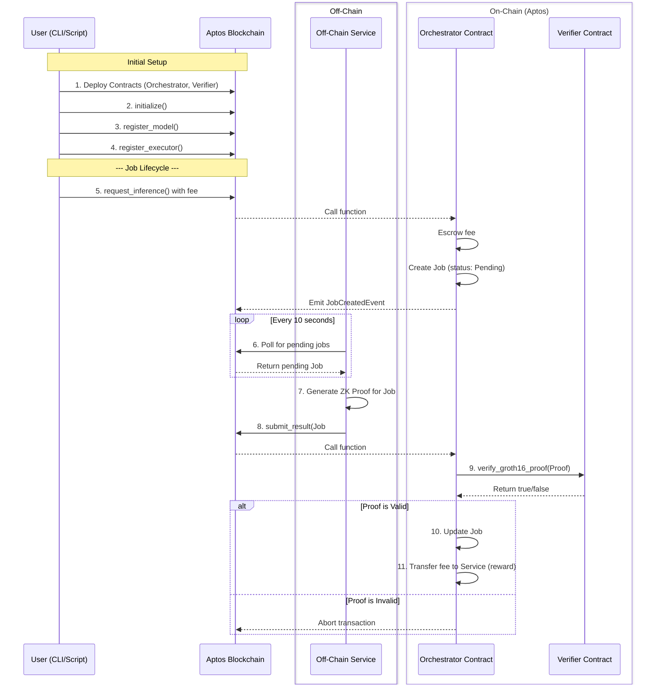

# ComretonAI MVP – A Verifiable Compute Network on Aptos

Welcome to the ComretonAI MVP! This project serves as a working proof-of-concept for a decentralized, trustless, and verifiable compute network built on the Aptos blockchain. Our mission is to empower developers to execute off-chain machine learning models and receive cryptographically secure, on-chain proofs of the inference results.

This MVP demonstrates the full end-to-end pipeline—from generating a Zero-Knowledge Proof (ZKP) for an ML model's output, to verifying that proof via a smart contract on the Aptos devnet—all coordinated by an automated off-chain service with a functioning economic incentive loop.

---

## Table of Contents

* [Project Architecture](#project-architecture)

  * [Core Components](#core-components)
  * [Workflow](#workflow)
* [Tech Stack](#tech-stack)
* [Repository Structure](#repository-structure)
* [Developer Guide (Getting Started)](#developer-guide-getting-started)

  * [Prerequisites](#prerequisites)
  * [Installation](#installation)
  * [Running the Full System](#running-the-full-system)
* [User Guide (Using the MVP)](#user-guide-using-the-mvp)

  * [Step 1: Initialize the System & Register a Model](#step-1-initialize-the-system--register-a-model)
  * [Step 2: Whitelist Your Account as an Executor](#step-2-whitelist-your-account-as-an-executor)
  * [Step 3: Test the Full Economic Loop](#step-3-test-the-full-economic-loop)

---

## Project Architecture

ComretonAI is a hybrid on-chain/off-chain system that merges the computational power of off-chain processing with the immutability and trust guarantees of a public blockchain.



---

### Core Components

1. **On-Chain Contracts (Aptos & Move):**

   * **`mlp_verifier.move`** – A lightweight smart contract containing a hardcoded verification key for the ML model. It performs a cryptographic `bn254_pairing_check` to validate proofs.
   * **`orchestrator.move`** – The main application logic. It manages:

     * Model registration
     * Job creation and tracking
     * Escrow and reward distribution
     * Executor allowlisting
     * Job lifecycle events

2. **Off-Chain Crypto Engine (Circom & snarkJS):**

   * **`mlp.circom`** – A ZKP circuit representing a 2-layer Multi-Layer Perceptron (MLP).
   * **`run.mjs`** – A Node.js script that uses `snarkjs` to generate ZKPs from weights and inputs.

3. **Off-Chain Services (Node.js):**

   * **`comreton-service.mjs`** – A backend agent that:

     * **Indexes** the blockchain for pending jobs.
     * **Executes** the prover and submits results back on-chain.

---

### Workflow

1. **Setup (Admin):** Deploy contracts, initialize, and register executors.
2. **Inference Request (User):** The user pays a fee and submits an inference request.
3. **Job Detection (Service):** The off-chain service detects pending jobs.
4. **Proof Generation (Service):** It generates a ZK proof using the prover circuit.
5. **Result Submission (Service):** It submits the result and proof to the blockchain.
6. **Verification (On-Chain):** If valid, the job is marked complete and the fee is rewarded.

---

## Tech Stack

* **Blockchain:** Aptos (Devnet)
* **Smart Contracts:** Move
* **Zero-Knowledge Proofs:** Circom, snarkjs
* **Off-Chain Automation:** Node.js

---

## Repository Structure

```
ComretonAI/
├── packages/
│   ├── aptos/             # Move smart contracts
│   │   ├── sources/
│   │   │   ├── verifier.move
│   │   │   └── orchestrator.move
│   │   └── Move.toml
│   ├── circuits/          # Circom circuit + prover logic
│   │   ├── mlp.circom
│   │   └── run.mjs
│   ├── services/          # Off-chain job poller and executor
│   │   └── comreton-service.mjs
│   └── submitter/         # CLI scripts for dev/test
│       ├── test_orchestrator.mjs
│       ├── whitelist_executor.mjs
│       └── test_economic_loop.mjs
└── README.md
```

---

## Developer Guide (Getting Started)

This section walks you through setting up your local environment.

### Prerequisites

* **Node.js** (v18+)
* **Rust & Cargo** (for Circom)
* **Aptos CLI** (latest)
* **Git**

### Installation

```bash
# Clone repo
git clone https://github.com/pro-utkarshM/ComretonAI/
cd ComretonAI
```

```bash
# Install Circom
cargo install circom
```

```bash
# Install Node dependencies
cd packages/circuits && npm install
cd ../submitter && npm install
cd ../services && npm install
cd ../..  # Back to root
```

```bash
# Set up Aptos account
cd packages/aptos
aptos init
# Then update your Move.toml and .mjs scripts with the new address/private key
```

---

### Running the Full System

1. **Deploy Contracts:**

```bash
cd packages/aptos
aptos move publish
```

2. **Start the Service:**

```bash
cd ../services
node comreton-service.mjs
```

3. **Submit Work via Scripts:**

```bash
cd ../submitter
node test_orchestrator.mjs
```

---

## User Guide (Using the MVP)

This guide will help you interact with the MVP and test the complete inference and reward loop.

> Ensure all scripts in `submitter/` are configured with your Aptos account and private key.

---

### Step 1: Initialize & Register a Model

```bash
cd packages/submitter
node test_orchestrator.mjs
```

**Outcome:** Two transactions succeed. Contracts are initialized, and the model is registered.

---

### Step 2: Whitelist Executor Account

```bash
node whitelist_executor.mjs
```

**Outcome:** Your account is added to the executor allowlist.

---

### Step 3: Test the Full Economic Loop

```bash
node test_economic_loop.mjs
```

**What it does:**

* Requests inference (User)
* Detects & solves job (Executor)
* Submits proof + receives reward

**Expected Output:**

```
🎉 CONGRATULATIONS! Phase 3 Complete! 🎉
The full economic loop (Pay -> Escrow -> Work -> Reward) is working.
```

---
